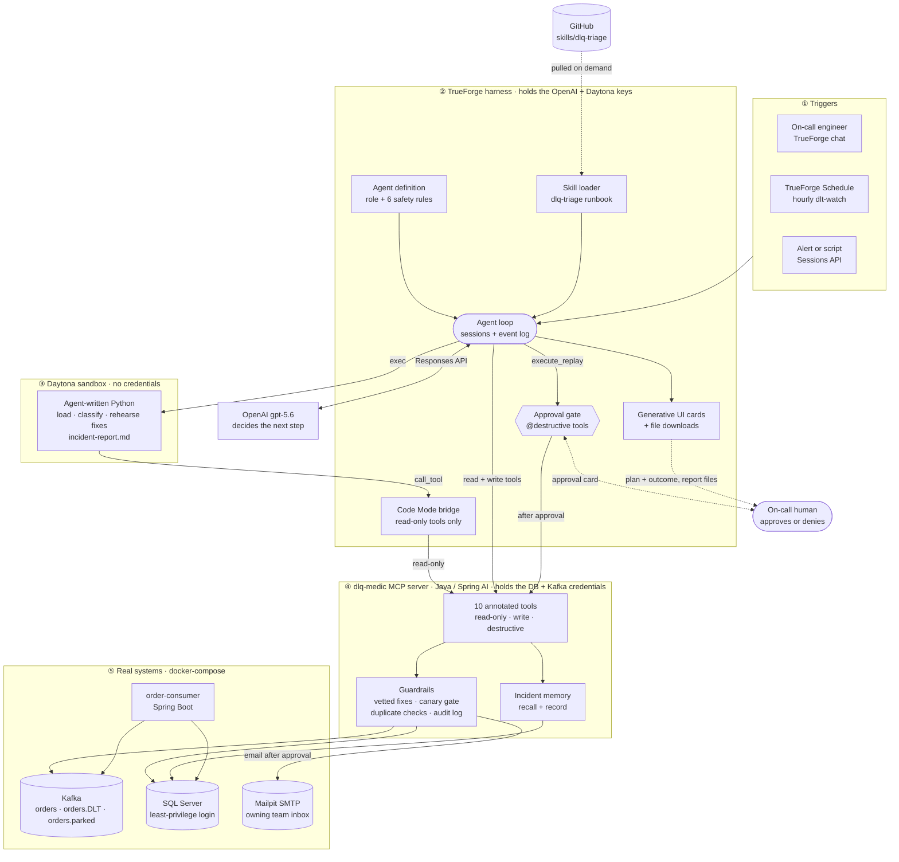
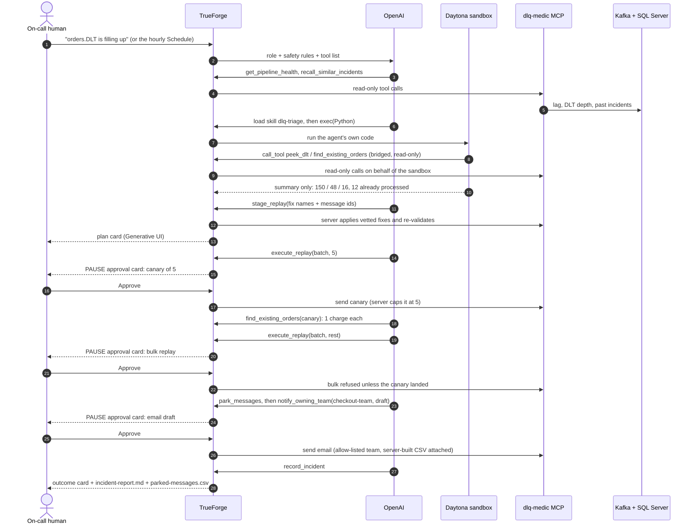

# DLQ Medic

**An on-call agent for Kafka dead-letter topics.** When orders pile up in `orders.DLT`, DLQ Medic works out why, repairs what can be repaired safely, replays it without double-charging anyone, and hands off what it can't fix. It stops for a human before anything irreversible.

Built on [TrueForge](https://github.com/truefoundry/trueforge) for the Polaris × TrueFoundry *Agents That Act* hackathon.

## The job

It's 3 AM. checkout-service v2.3.1 shipped a serialization bug, and 214 orders are in the dead-letter topic. The on-call engineer has two bad options:
- **Skip them:** lost orders.
- **Replay them blindly:** the order consumer isn't idempotent, so any order that was already re-sent gets **charged twice**.

DLQ Medic does the careful version of this job:

| Step | Where it runs |
|---|---|
| Check pipeline health, lag and the affected producer versions | MCP tool (Kafka Admin) |
| Load all 214 DLT messages, group them by error pattern | **Sandbox** (Python written by the agent; Code Mode reads through the harness) |
| Rehearse the fix and validate every result against the contract | **Sandbox** |
| Check for orders that were already processed | Sandbox → read-only MCP tool (SQL Server) |
| Stage the batch: the server applies a **vetted fix** and re-validates | MCP tool |
| **⏸ Canary: replay 5** | **Human approval** |
| Verify each canary order exists with exactly 1 charge | MCP tool |
| **⏸ Replay the rest** | **Human approval** |
| Park what can't be fixed (e.g. missing customerId) for the owning team | MCP tool |
| Report root cause, counts and a recommendation | Agent |

Result on the seeded incident: **186 replayed, 12 skipped as already processed, 16 parked, 0 double charges.**

## How it uses TrueForge

| TrueForge feature | How DLQ Medic uses it |
|---|---|
| **MCP connector** | `dlq-medic-mcp` (Java / Spring AI) is the agent's only way into Kafka and SQL Server |
| **Tool approval** | Tools are annotated read-only / write / destructive; only `execute_replay` pauses for a human |
| **Sandbox + Code Mode** | The agent's own Python loads, classifies and rehearses fixes on every DLT message; read-only MCP calls are bridged from the sandbox |
| **Git-backed Skill** | The runbook lives in [`skills/dlq-triage`](skills/dlq-triage) (SKILL.md + references), loaded on demand; the agent prompt keeps only the role and safety rules |
| **Schedules** | An hourly `dlt-watch` runs unattended: "All clear" when nothing is new, a full triage waiting at the approval card when something is |
| **Generative UI** | A plan card (donut + action table) before the first approval, and an outcome card with KPI tiles at the end |
| **Sandbox file downloads** | `incident-report.md` and `parked-messages.csv` handed to the human |
| **Approval on a real side effect** | `notify_owning_team` emails the owning team only after the human reads and approves the draft (Mailpit catches it locally) |
| **Sessions API** | `scripts/run-agent.py` triggers the agent headlessly (as an alert would) and reports tokens and cost |

## Architecture: the harness we built on TrueForge

TrueForge provides the harness: the agent loop, approval gate, sandbox bridge, skill loader, UI and sessions. We plugged the job into it: an MCP server with guardrails, a git-backed runbook skill, the agent definition, a schedule, and the real systems.



**One run through the harness** (the steps where TrueForge stops and waits are marked PAUSE):



| Component | Role | Knows | Never sees |
|---|---|---|---|
| **LLM** (via TrueForge) | Decides the next step | Instructions, tool descriptions, tool results | DB/Kafka credentials. Can't act except through tools. |
| **TrueForge** | Runs the loop, pauses for approval, logs every event | The whole transcript; model and Daytona keys | DB/Kafka credentials |
| **Daytona sandbox** | Runs the agent's own code | The code and the data given to it | All credentials; can only call **read-only** tools |
| **dlq-medic-mcp** | The only way into Kafka and SQL Server; enforces the rules | Tool calls and arguments | The conversation, the model's reasoning |
| **Human** | Approves or denies anything irreversible | Chat, approval cards, session log | n/a |

## Where it stops

Safety is enforced **in the MCP server and the database**, not in the prompt.

| Tool | MCP annotation | Gate |
|---|---|---|
| `get_pipeline_health`, `peek_dlt`, `find_existing_orders`, `recall_similar_incidents`, `get_audit_log` | read-only | none (also callable from sandbox Code Mode) |
| `record_incident` | write, append-only | none: it only adds to the agent's memory, and the server computes the facts |
| `stage_replay` | write, non-destructive | none: it only writes our own staging tables |
| `park_messages` | write, non-destructive | none: it only adds data, and the DLT keeps its copy |
| **`execute_replay`** | **destructive** | **human approval, every call** |
| **`notify_owning_team`** | **destructive** (an email can't be unsent) | **human approval**: the card shows recipient team, subject and body |

**Server-side rules, independent of what the model says:**
- **Vetted fixes only.** The model picks a fix by name (`amount_string_to_number`, `epoch_millis_to_iso8601`) for a list of message IDs. The server applies it to the original payload, so **the model never writes the bytes that reach production**.
- Every staged payload is **re-validated** against the consumer's contract, and the **orderId can't change**.
- **Canary enforced by the server.** The first `execute_replay` on a batch sends at most 5. Further calls are **refused until every canary order is in the orders table**.
- **Duplicate check at stage time and again at send time.** Orders that were already processed are skipped.
- The replay target topic is a constant, not a parameter.
- **Email only to allow-listed teams.** The model picks a team name (`checkout-team`, `oncall`), never an address; the server builds the `parked-messages.csv` attachment itself; one email per batch.
- **Not exposed at all:** delete topic, reset offsets, raw produce, arbitrary SQL.

**The database backs this up (SQL Server least privilege):**
- The `dlq_medic` login is **read-only** on `orders` and `payment_ledger`.
- It is **DENY UPDATE/DELETE** on its own `agent_audit_log`, so the agent cannot erase its trail.

**TrueForge backs this up too:**
- `require_approval_for_tools: ["@destructive"]`.
- Code Mode refuses any non-read-only tool, so writes can't be hidden inside a sandbox script.
- The SSRF guard stays on, with exactly one host allow-listed (`localhost`).

## Run it

**Prerequisites**
- Docker Desktop (4 GB is enough; on Apple Silicon turn on Rosetta, because SQL Server is amd64-only)
- Java 21
- Node 22.14+
- Python 3
- An LLM API key (OpenAI recommended)
- A [Daytona](https://daytona.io) API key with *Sandboxes* access and *Snapshots write* permission

**1. Infrastructure and the incident**
```bash
./scripts/init-env.sh        # generates local-only DB passwords into .env (gitignored)
docker compose up -d         # Kafka + SQL Server + Mailpit; creates topics, schema and least-privilege logins
./scripts/reset-demo.sh      # publishes the incident: 500 healthy + 214 broken + 12 hotfix re-sends
```

**2. Services** (two terminals)
```bash
cd order-consumer && ./mvnw spring-boot:run     # processes orders; 214 land in orders.DLT
cd dlq-medic-mcp  && ./mvnw spring-boot:run     # MCP server on http://localhost:8081/mcp
```

**3. TrueForge** (third terminal). The allowlist lets TrueForge reach the local MCP server; everything else stays blocked.
```bash
OUTBOUND_URL_ALLOWED_HOSTS='["localhost"]' npx --yes @truefoundry/trueforge@latest
```
Then open http://localhost:8790:
- **Settings → Models:** add your provider key.
- **Settings → Sandbox providers:** add your Daytona key.

**4. Create the agent**
```bash
MODEL=openai/gpt-5-6-terra ./scripts/create-agent.sh   # registers the MCP server + skill, creates the dlq-medic agent
./scripts/create-schedule.sh --run-now                  # optional: hourly unattended watch, plus one run now
```

**5. Run it**
- In the UI: **New chat → dlq-medic →** `orders.DLT is filling up. Sort it out.` Approve the canary, then the bulk replay.
- Or headless, the same API an alerting system would call:
  ```bash
  python3 scripts/run-agent.py --msg "orders.DLT is filling up. Sort it out." --on-approval ask
  ```

**See the emails** the agent sends (after your approval) at http://localhost:8025 (Mailpit web inbox).

**Reset between runs:** stop `order-consumer`, run `./scripts/reset-demo.sh`, then start it again.

## Repository

| Path | What |
|---|---|
| `docker-compose.yml`, `infra/sql/init.sql` | Kafka KRaft, SQL Server, topics, schema, least-privilege logins |
| `order-consumer/` | The service being protected: strict contract → DLT; non-idempotent upsert + charge |
| `dlq-medic-mcp/` | The MCP server: 7 tools, vetted fixes, guardrails, audit log |
| `agent/instructions.md` | The agent's role and six safety rules |
| `skills/dlq-triage/` | The git-backed runbook skill: SKILL.md, the orders contract + vetted fixes, report templates |
| `scripts/` | `init-env`, `seed`, `reset-demo` (`--forget` wipes memory), `create-agent`, `create-schedule`, `run-agent` |

## Learning over time

**The agent may learn *how* to do the job, but never changes *what it's allowed* to do.** Every lesson follows the same path as code: proposal → evidence → human approval → versioned → pinned.

**Built today: incident memory.** At the end of each run the agent calls `record_incident`. The server stores the error patterns (computed by the server, not phrased by the model), the verified facts from the batch (replayed, skipped, double charges), the human's approve/deny decisions and the agent's lessons. On the next incident, `recall_similar_incidents` scores past incidents by pattern similarity, and the agent starts with *"seen before: same producer bug, this fix worked, 0 double charges"*. The table is append-only for the agent, and memory survives demo resets (`reset-demo.sh --forget` wipes it).

**Roadmap**

```
 incident ─▶ agent run ─▶ ① record_incident ─▶ incident_memory ─▶ recalled next time
                                  │
                                  ▼ nightly TrueForge Schedule
                       ② retrospective agent reads sessions, audit log, deny reasons
                          proposes runbook edits · new vetted fixes · policy changes
                                  ▼
                       ③ evidence: new fix proven in the sandbox on real failed messages
                          + eval suite of seeded incidents (must keep 0 double charges)
                                  ▼
                       ④ human review: PR to skills/ or the fix catalogue ─▶ merge ─▶ pin the skill commit
```

| What learns | Mechanism | Who approves |
|---|---|---|
| Incident memory ✅ | `record_incident` / `recall_similar_incidents` | nobody needed: it's a record |
| The runbook | Retrospective agent opens a PR to `skills/dlq-triage` | an engineer |
| New vetted fixes | Agent proves a transform in the sandbox on the real messages, then proposes it with test cases | an engineer, and the evals must pass |
| Human preferences | Deny reasons from session events become proposed runbook rules | an engineer |
| Earned autonomy | A fix with a long clean record may skip the canary click; **bulk replay always needs a human** | engineers change the policy; the agent never grants itself autonomy |

## AI assistance disclosure

Built with help from **Claude Code** (Anthropic) for design discussion, code generation and debugging. The architecture, the safety model and every line of code were reviewed, and can be explained, by the author.
